## Как войти в админку 101hit.ru

- Перейти на http://101hit.ru/admin/
- Ввести креды для входа: `Пароль: [***]` `Логин: [***]`

## Как отключить клиента от CMS

- Чтобы отключить клиента нужно перейти во вкладку `Спутник`
- Найти сайт, который необходимо отключить
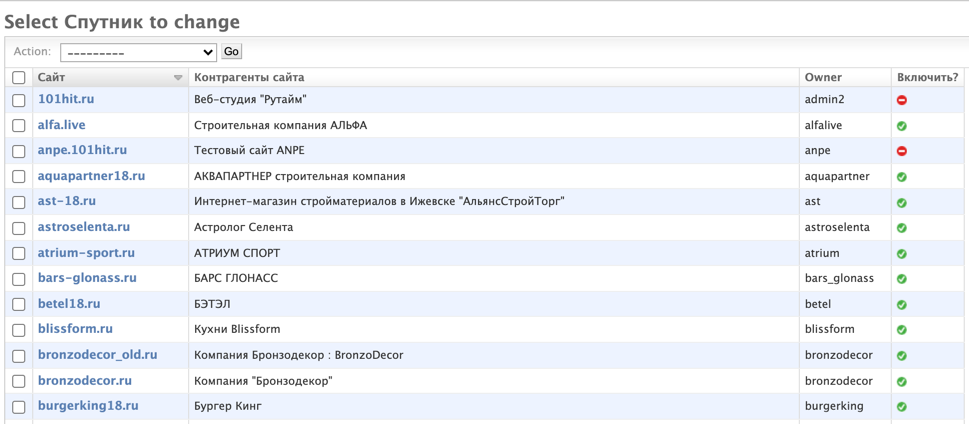
  
- Далее смотрим кто владелец сайта, это можно сделать в колонке `owner`
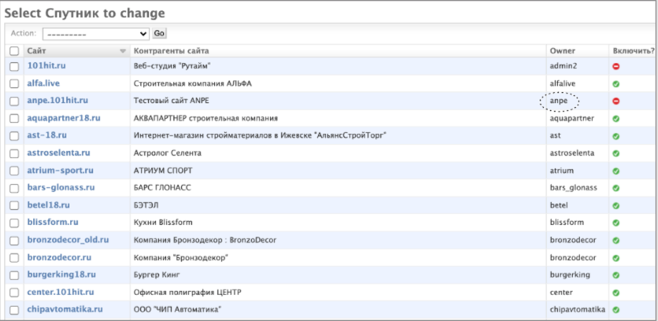
  
- Затем переходим во вкладку `Users` и ищем владельца
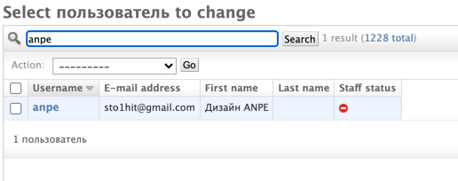
  
- Кликаем на Username в нашем случае это `anpe`
- После этого мы попадаем в настройки юзера и перелистываем их в самый низ и находим кнопку `удалить` 

  
## В меню Geo objects

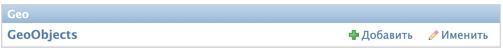

- Находятся объекты, которые отображаются на карте
  Это меню не нужно трогать, тк скорее всего это отображение объектов из БД

## В меню Satellite
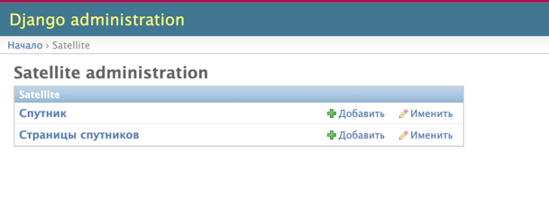

- Во вкладке `Спутник` можно добавить сайт и добавить описания для него, а также указать Yandex verification meta и Google verification meta

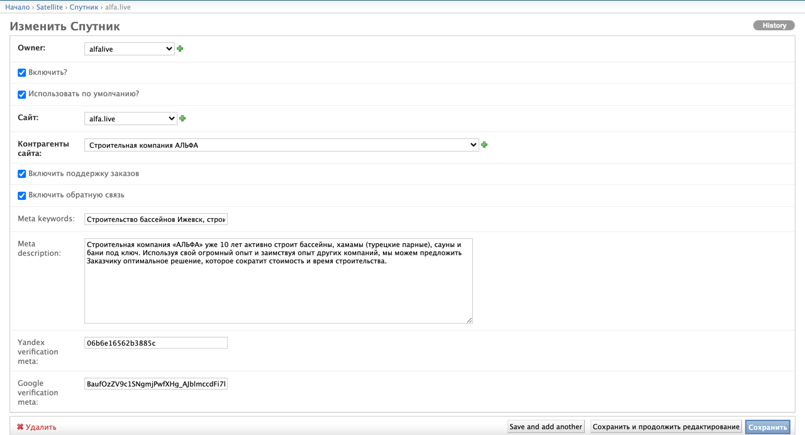

- На вкладке `Страницы спутников` находится заголовки страниц с содержимым

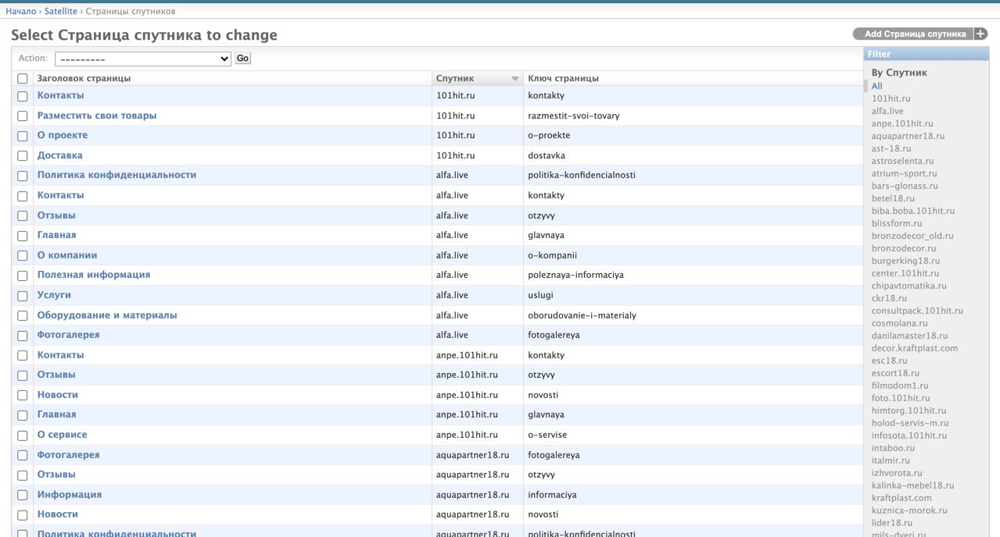

- В фильтре можно выбрать конкретный сайт и просмотреть все заголовки с содержанием, которое принадлежит выбранному сайту

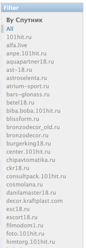

## В меню Shop

- В меню `Shop` различные настройки типов и групп товаров которые будут отражаться в личном кабинете у владельца `сайта(Спутника)`

## В меню Contractor

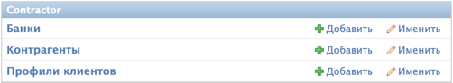

- В этих вкладках содержится информация о `контрагентах` которые можно выбрать при создании `спутника`, а также информацию о банках и клиентах, то есть записях, под которыми входят владельцы `сайтов`

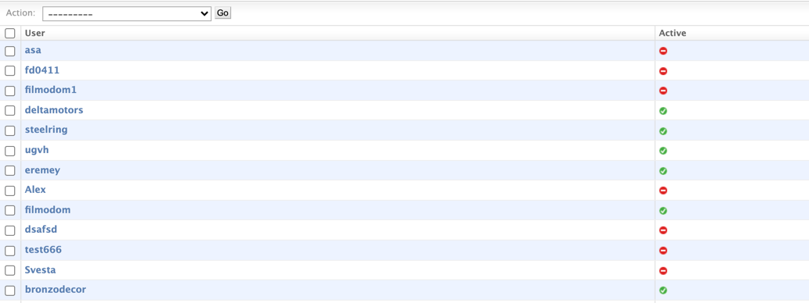

- Профиль можно активировать или деактивировать 

## Аккаунт клиента

- В аккаунте клиента можно редактировать содержимое страниц сайта, а также добавлять новые страницы 

### Вход в аккаунт клиента

- Заходим на http://101hit.ru/ `Перед тем как перейти на 101hit, нужно выполнить вход как администратор`

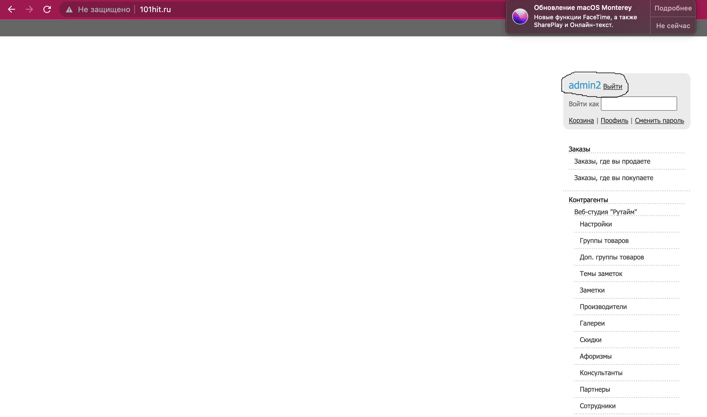

- Далее вводим владельца сайта `(owner)` в строку `Войти как`

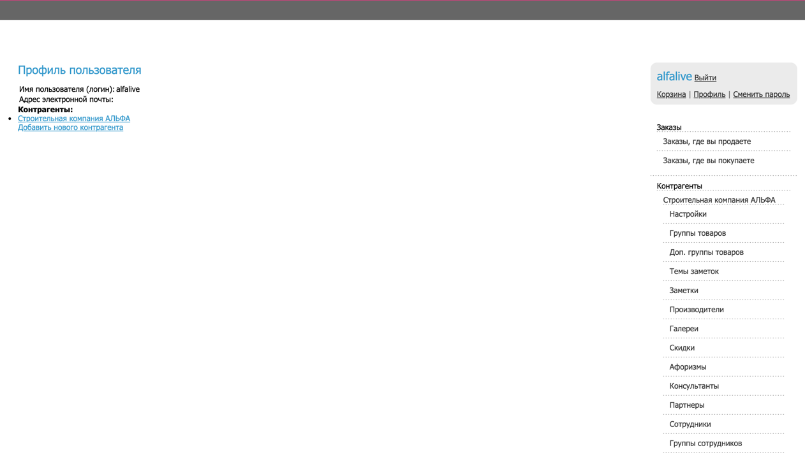

- В меню `Контрагенты` можно выбрать контрагента и изменить контактную информацию

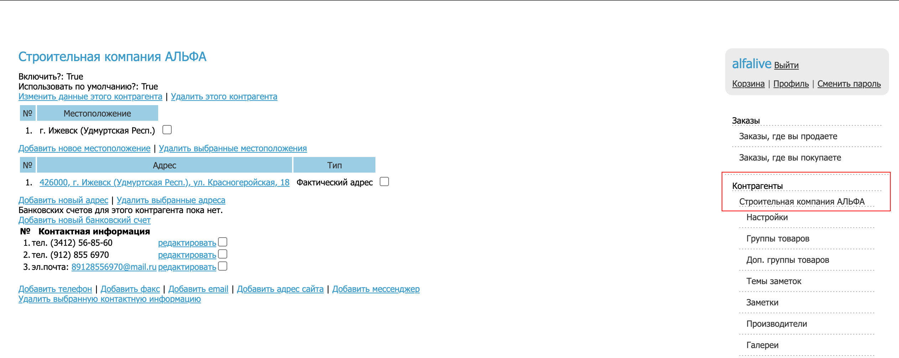

- В меню `Группы товаров` можно редактировать описание товара, а также менять картинки сопутствующие данному товару (В секции `Доп.группы товаров` возможно тоже самое но в)

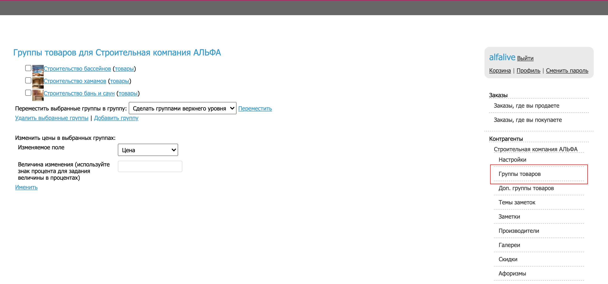

- На сайте http://alfa.live/ товары находятся в разделе услуги, на других сайтах эта секция может называться по другому, например `каталог`

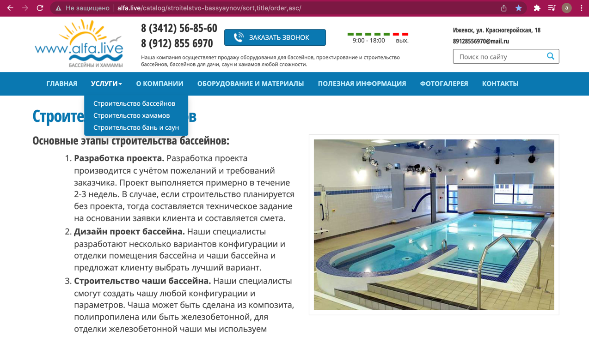

- При нажатии на товар в нашем случае `Строительство бассейнов` в разделе группы товаров, откроется редактирование информации о товаре, которая отражена на сайте

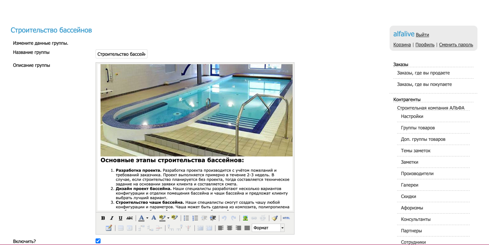

- На сайте альфы есть список поставщиков/производителей

- Чтобы его изменить необходимо перейти в меню `Производители`, там будет список из всех производителей, в который можно добавить нового производителя или изменить название или картинку о старом производителе

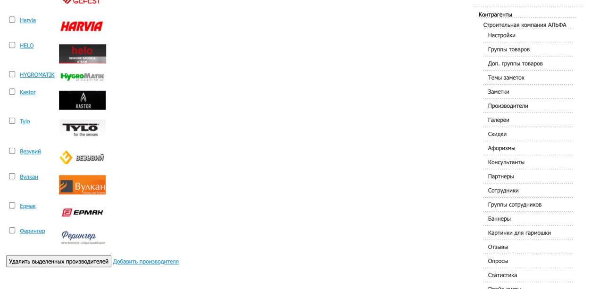

- В меню `Фотогалереи` можно создать галереи, которые будут отражаться на страницах сайтов

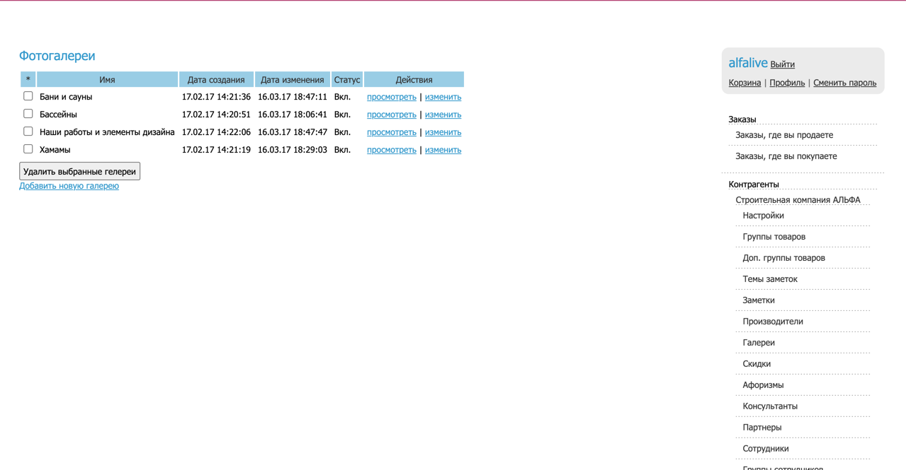

- Ниже представлен пример, где можно использовать фотогалереи.
Фото галерею можно добавить на страницу сайта в настройках `Страницы сайта`

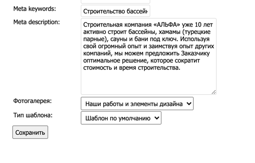

- В меню `Баннеры` можно добавить баннеры, которые будут отображаться на сайте или изменить существующие 

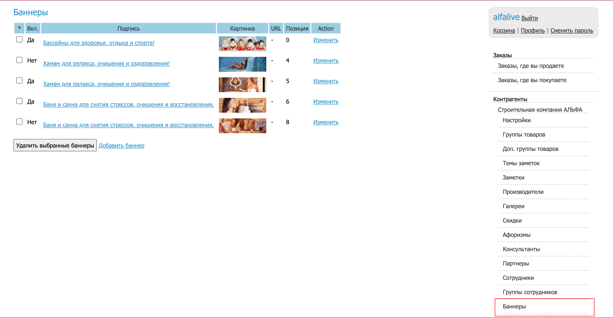
Ниже представлен пример, где баннеры отображены на сайте

### Меню Страницы сайта

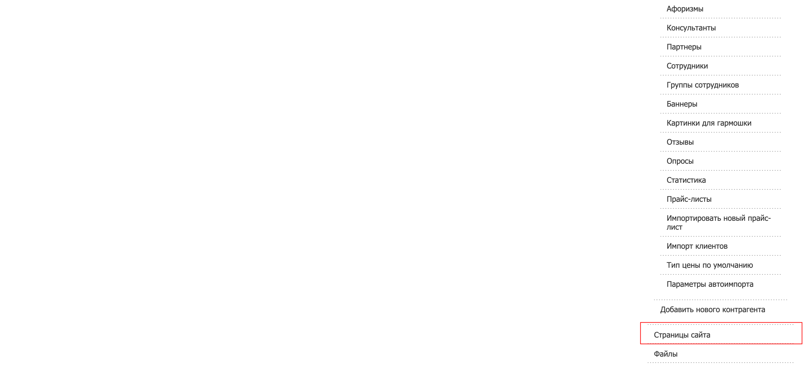

- В меню `Страницы сайта` можно редактировать содержимое отображаемых страниц на сайте или создавать новые страницы.
Ниже представлены все страницы сайта альфы, содержимое которых можно редактировать
  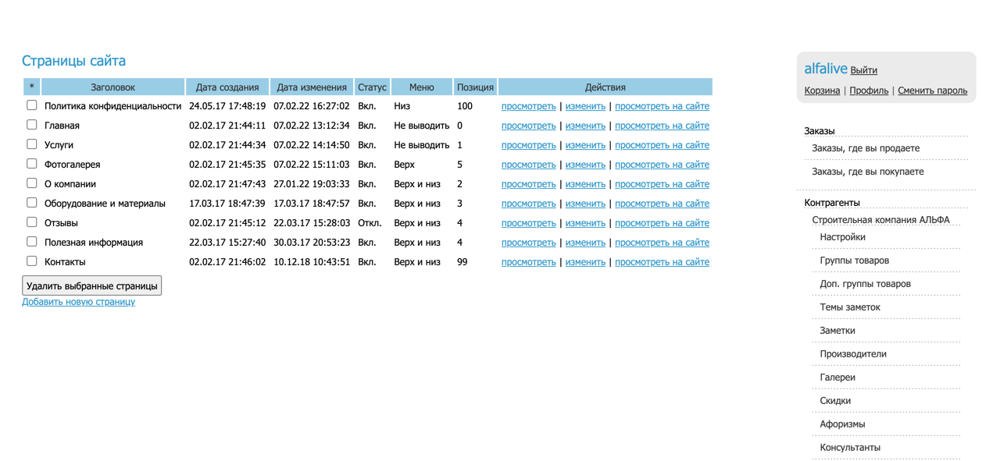
  

