## Как войти в админку 101hit.ru

- Перейти на http://101hit.ru/admin/
- Ввести креды для входа: `Пароль: [***]` `Логин: [***]`

## Как отключить клиента от CMS
Шаги по отключению клиента можно пропустить, если этого не требуется и можно перейти сразу к шагу создания заглушки
- Чтобы отключить клиента нужно перейти во вкладку `Спутник`
- Найти сайт, который необходимо отключить

  
- Далее смотрим кто владелец сайта, это можно сделать в колонке `owner`

  
- Затем переходим во вкладку `Users` и ищем владельца

  
- Кликаем на Username в нашем случае это `anpe`
- После этого мы попадаем в настройки юзера и перелистываем их в самый низ и находим кнопку `удалить` 

  
### Заглушка для сайта
  
- Далее сделаем заглушку для сайта, к которому у клиента больше нет доступа
  (Верхние шаги можно не делать, чтобы сохранить запись клиента на случай, если клиент передумает)
  
- Заходим по `ssh` на сервер, креды для входа можно попросить у Виктора Сазонова. Чтобы войти по ssh,
необходимо открыть терминал(macOS/linux)/командную консоль(windows) и набрать:`ssh имяпользователя@ip-адрес сервера`,
  далее потребуется ввести пароль
  
- Далее вбиваем команду в терминал
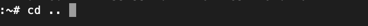
  
- Далее вбиваем команду

  
- Далее вбиваем команду `ls` в терминал и можем увидеть все конфиги всех сайтов
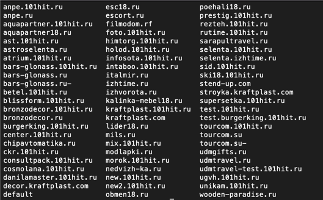
  
- Выбираем нужный кофиг(я для примера возьму конфиг сайта anpe.101hit.ru)
и вбиваем команду `nano имяконфига(адрес сайта)`, и должно появится окно с параметрами, которые можно редактировать
  
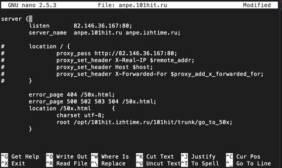

- Далее находим строчку, красным выделено имя сайта
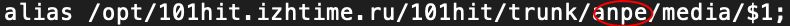
  
- Комментируем строчку(`#` - это значит строка закомментирована) и заменяем ее, то есть все должно выглядеть вот так:
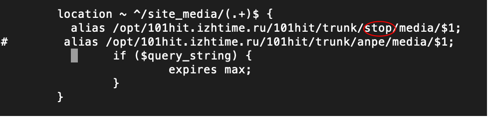
  
- Находим и комментируем еще одну строчку и заменяем ее, то есть все должно выглядеть вот так:
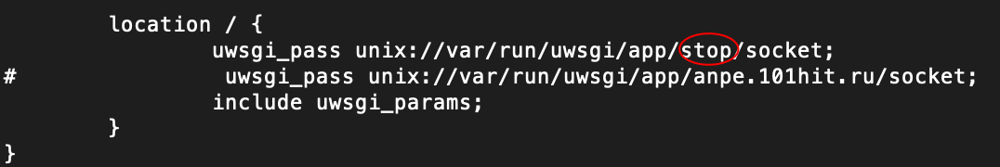
  
- Далее нажимаем `ctrl+x` и появляется окно
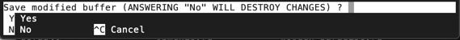
  Нажимаем `y` и нажимаем `enter`
  
- Далее пишем в терминале и нажимаем `enter`:
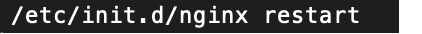
  
- Теперь при входе на сайт будет:
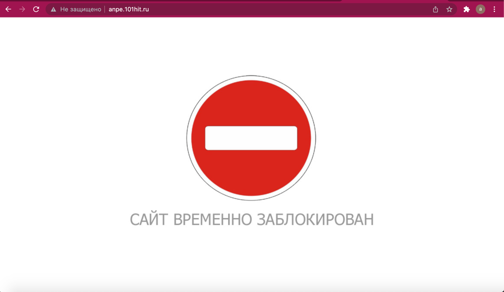
  
### Как разблокировать сайт

- Чтобы разблокировать сайт вам необходимо: проделать все шаги, которые gпоказаны на скриншоте,
только нужно закомментировать строчки, где есть красный эллипс и раскоментировать строчки, где его нет
  
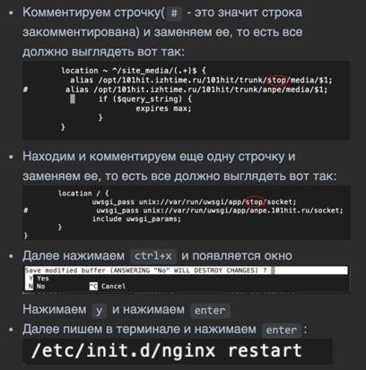

## В меню Geo objects

- Находятся объекты, которые отображаются на карте
  Это меню не нужно трогать, тк скорее всего это отображение объектов из БД

## В меню Satellite

- Во вкладке `Спутник` можно добавить сайт и добавить описания для него, а также указать Yandex verification meta и Google verification meta

- На вкладке `Страницы спутников` находится заголовки страниц с содержимым

- В фильтре можно выбрать конкретный сайт и просмотреть все заголовки с содержанием, которое принадлежит выбранному сайту

## В меню Shop

- В меню `Shop` различные настройки типов и групп товаров которые будут отражаться в личном кабинете у владельца `сайта(Спутника)`

## В меню Contractor

- В этих вкладках содержится информация о `контрагентах` которые можно выбрать при создании `спутника`, а также информацию о банках и клиентах, то есть записях, под которыми входят владельцы `сайтов`

- Профиль можно активировать или деактивировать 

## Аккаунт клиента

- В аккаунте клиента можно редактировать содержимое страниц сайта, а также добавлять новые страницы 

### Вход в аккаунт клиента

- Заходим на http://101hit.ru/ `Перед тем как перейти на 101hit, нужно выполнить вход как администратор`

- Далее вводим владельца сайта `(owner)` в строку `Войти как`

- В меню `Контрагенты` можно выбрать контрагента и изменить контактную информацию

- В меню `Группы товаров` можно редактировать описание товара, а также менять картинки сопутствующие данному товару (В секции `Доп.группы товаров` возможно тоже самое но в)

- На сайте http://alfa.live/ товары находятся в разделе услуги, на других сайтах эта секция может называться по другому, например `каталог`

- При нажатии на товар в нашем случае `Строительство бассейнов` в разделе группы товаров, откроется редактирование информации о товаре, которая отражена на сайте

- На сайте альфы есть список поставщиков/производителей

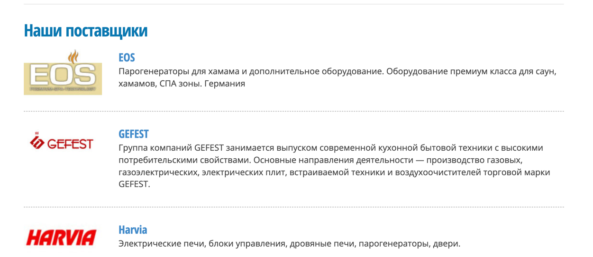

- Чтобы его изменить необходимо перейти в меню `Производители`, там будет список из всех производителей, в который можно добавить нового производителя или изменить название или картинку о старом производителе

- В меню `Фотогалереи` можно создать галереи, которые будут отражаться на страницах сайтов

- Ниже представлен пример, где можно использовать фотогалереи.
Фото галерею можно добавить на страницу сайта в настройках `Страницы сайта`

- В меню `Баннеры` можно добавить баннеры, которые будут отображаться на сайте или изменить существующие 

Ниже представлен пример, где баннеры отображены на сайте

### Меню Страницы сайта

- В меню `Страницы сайта` можно редактировать содержимое отображаемых страниц на сайте или создавать новые страницы.
Ниже представлены все страницы сайта альфы, содержимое которых можно редактировать
  
  

