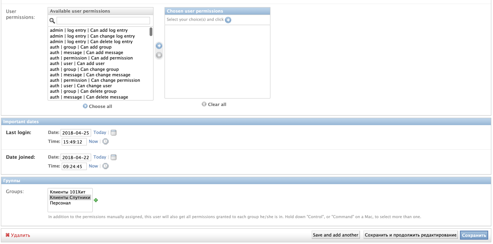

## Как войти в админку 101hit.ru

- Перейти на http://101hit.ru/admin/
- Ввести креды для входа: `Пароль: [***]` `Логин: [***]`

## Как отключить клиента от CMS

- Чтобы отключить клиента нужно перейти во вкладку `Спутник`
- Найти сайт, который необходимо отключить

  
- Далее смотрим кто владелец сайта, это можно сделать в колонке `owner`

  
- Затем переходим во вкладку `Users` и ищем владельца

  
- Кликаем на Username в нашем случае это `anpe`
- После этого мы попадаем в настройки юзера и перелистываем их в самый низ и находим кнопку `удалить` 

  

## В меню Satellite

- Во вкладке `Спутник` можно добавить сайт и добавить описания для него, а также указать Yandex verification meta и Google verification meta

- На вкладке `Страницы спутников` находится заголовки страниц с содержимым

- В фильтре можно выбрать конкретный сайт и просмотреть все заголовки с содержанием, которое принадлежит выбранному сайту

## В меню Shop

- В меню `Shop` различные настройки типов и групп товаров которые будут отражаться в личном кабинете у владельца `сайта(Спутника)`

## В меню Contractor

- В этих вкладках содержится информация о `контрагентах` которые можно выбрать при создании `спутника`, а также информацию о банках и клиентах, то есть записях, под которыми входят владельцы `сайтов`

- Профиль можно активировать или деактивировать 

